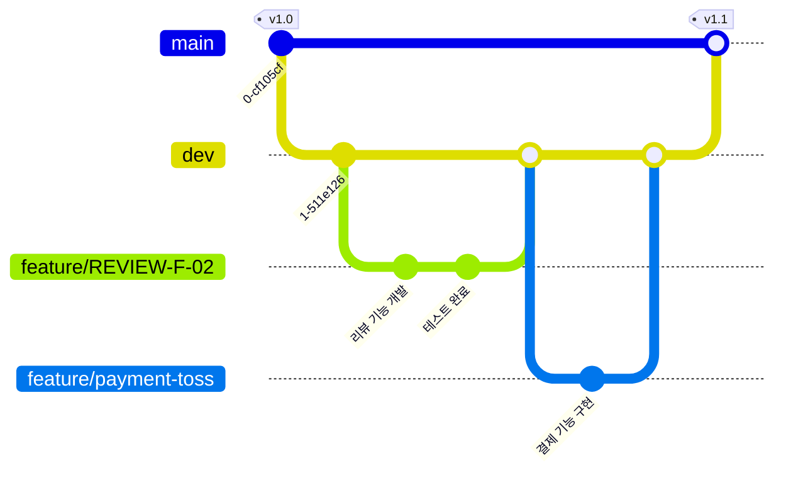

```

## 문서화 포인트

실제 문서화할 때 포함할 내용:[3]
- **브랜치 네이밍 규칙**: feature/, fix/, chore/ 등의 prefix 사용
- **작업 흐름**: main → dev → feature 순서로 분기, 역순으로 병합
- **머지 규칙**: feature는 항상 dev로 먼저 머지, dev에서 테스트 후 main으로 배포
- **릴리스 관리**: main 브랜치 머지 시 태그 생성

이렇게 하면 수백 개의 커밋 히스토리 대신, 핵심 워크플로우만 간결하게 전달할 수 있습니다. README나 CONTRIBUTING.md에 이런 다이어그램을 추가하면 팀 전체가 일관된 브랜치 전략을 유지하는 데 도움이 됩니다.[2][5][1]
