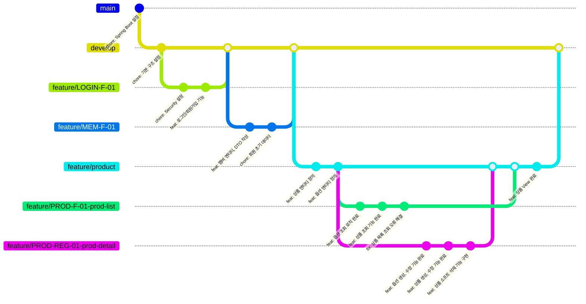

## Git 협업 전략

**기간**: 4주 (2025년 12월)  
**팀 구성**: 백엔드 개발자 4명  
**사용 도구**: GitLab, Git Flow  
**협업 성과**: 총 411개 커밋, 주요 feature 브랜치 병렬 개발 완료

commit id: "feat: 옵션 조회 기능 완료" → 실제: [PROD-F-01] feat: 상품 옵션 조회 API 구현 
commit id: "fix: 상품 목록 조회 오류 해결" → 실제: [PROD-F-01] fix: 판매중지 상품 검색 제외 처리 

### 브랜치 네이밍 전략

프로젝트에서는 **기능명세서의 이슈 코드를 브랜치명에 직접 반영**하여 작업 추적이 가능하도록 했습니다.  
예를 들어 `feature/PROD-F-01-prod-list`, `feature/LOGIN-F-01`처럼 기능명세 코드를 포함하여 어떤 요구사항을 구현하는 브랜치인지 명확히 식별할 수 있습니다.

### 도메인별 통합 브랜치 전략

이 프로젝트의 핵심 전략은 **도메인 중심의 브랜치 구조**입니다.

- **도메인 브랜치 생성**: `develop`에서 `feature/product` 같은 도메인별 상위 브랜치를 분기
- **기능 브랜치 생성**: 도메인 브랜치에서 `feature/PROD-F-01-prod-list`, `feature/PROD-REG-01-prod-detail` 같은 세부 기능 브랜치를 생성
- **도메인 브랜치로 머지**: 각 기능 완료 후 도메인 브랜치(`feature/product`)로 먼저 머지
- **develop 브랜치로 통합**: 도메인의 모든 기능이 완료되면 도메인 브랜치 전체를 `develop`에 머지

이 방식은 도메인별로 여러 기능을 병렬 개발하면서도 통합 시점을 제어할 수 있어 효과적이었습니다.

### 커밋 메시지 컨벤션

모든 커밋 메시지는 `[이슈코드] 타입: 내용` 형식을 따릅니다.

- `[PROD-F-01] feat: 상품 옵션 조회 API 구현`
- `[PROD-REG-01] fix: 상품 수정, 삭제 오류 해결`

이를 통해 **커밋과 기능명세서를 연결**하여 프로젝트 진행도에 대한 추적성을 확보했습니다.

### 코드 리뷰 프로세스

매일 아침 진행 상황 공유를 통해 팀 동기화를 유지했습니다.

- **진행 내용**: 전날 완료 작업, 당일 계획 공유
- **소요 시간**: 30 ~ 40분
- **효과**: 중복 작업 방지 및 도메인 간 의존성 사전 파악
- **리뷰 중점 사항**
    - 예외 처리 및 에러 핸들링 적절성
    - 초기 합의한 기능명세 내용과의 일치 여부
    - 구현 과정에서 발생한 변경 사항 논의
---

## Merge Request 충돌 관리 전략

### 충돌 발생 원인

프로젝트 진행 중 다음과 같은 상황에서 충돌이 자주 발생했습니다:

1. **같은 도메인 작업 시**
    - 여러 명이 `feature/product` 도메인 브랜치 아래에서 각자 기능 브랜치(`feature/PROD-F-01`, `feature/PROD-REG-01` 등)를 만들어 작업
    - 다른 팀원이 먼저 자신의 기능을 `feature/product`에 머지하면 도메인 브랜치가 업데이트됨
    - 나머지 팀원이 업데이트된 `feature/product` 버전을 반영하지 않고 자신의 기능 브랜치에서 푸시 및 MR을 하면 **충돌 가능성이 높아짐**

2. **다른 도메인 작업 시**
    - `dev` 브랜치의 최신 변경사항을 반영하지 않은 채 푸시 및 머지 요청을 했을 때 충돌 발생

### 해결 방안

#### 로컬 선행 머지 전략

기능 구현을 완료하여 머지해야 하는 상황에서는 다음 프로세스를 따랐습니다:

1. **원격 저장소 최신화**: `git fetch origin`으로 원격의 최신 상태 확인
2. **로컬에서 선행 머지**: 머지 대상 브랜치(예: `feature/product` 또는 `dev`)를 로컬에서 먼저 머지
3. **충돌 해결**: 충돌 발생 시 로컬에서 직접 해결 후 테스트
4. **푸시 및 MR**: 충돌이 해결된 상태로 작업 브랜치에 푸시하여 Merge Request 생성

**결과**: 이 방식을 도입한 후 주 5~6회 발생했던 Merge 충돌을 위 프로세스로 주 1회 이하로 감소시켰습니다.

#### 크로스 도메인 작업 시 협업 프로세스

본인 담당이 아닌 도메인이나 기능 부분의 코드를 작성해야 할 때:

1. 해당 부분 담당 인원과 함께 **작업 브랜치와 중심 브랜치의 작업 트리 비교** 실시
2. 코드 누락이나 충돌 가능성을 사전에 검토 및 논의
3. 합의 후 작업 진행

이를 통해 **도메인 간 의존성으로 인한 충돌과 코드 누락을 최소화**할 수 있었습니다.