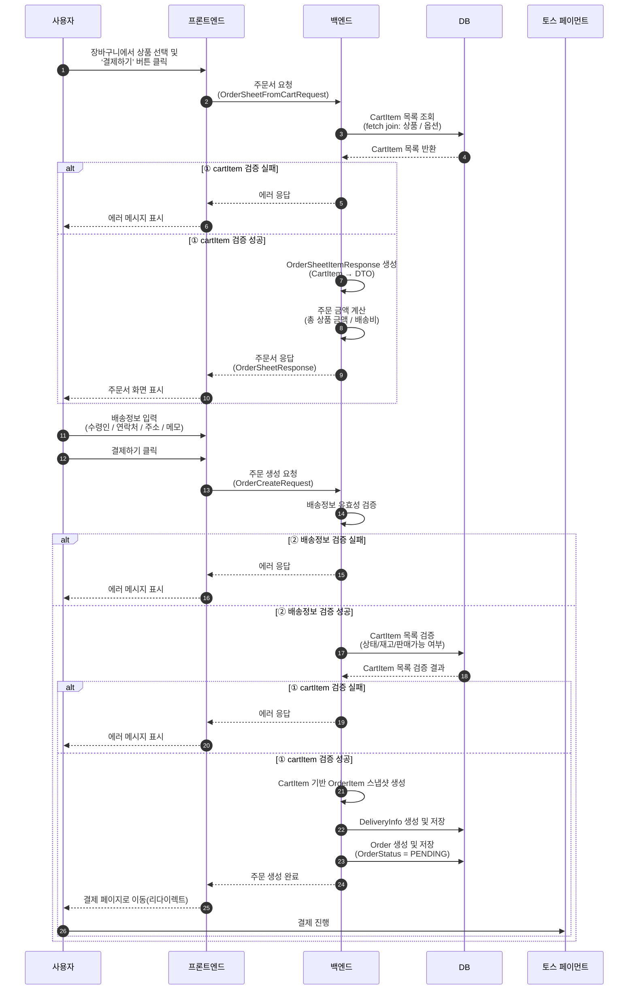

## 주문 생성 로직

### 기능 개요
- 사용자가 장바구니에서 선택한 상품을 기반으로 주문서(Order Sheet)를 생성하고, 배송 정보를 입력하여 주문(Order)을 생성한 뒤 결제 단계로 이동하는 프로세스입니다.

- 주문서는 DB 기준 최신 상품/옵션 정보와 재고 상태를 기반으로 생성되며,
가격 변조 및 판매 불가 상품 주문을 방지하기 위해 cartItem 검증 로직을 포함합니다.

- 주문 생성 시에는 배송 정보에 대한 유효성 검증과 함께,
주문서 생성 이후 변경될 수 있는 상품 상태를 고려하여 장바구니 항목을 재검증합니다.

- 모든 주문 생성 로직은 하나의 트랜잭션으로 처리되며,
검증 실패 또는 예외 발생 시 주문 및 배송 정보는 저장되지 않고 롤백됩니다.

- 주문이 정상적으로 생성되면 주문 상태는 결제 대기(PENDING) 로 설정되며,
사용자는 외부 결제 수단(토스 페이먼트)을 통해 결제를 진행하게 됩니다.

### [주문서 작성 및 주문 생성 다이어그램]

## 핵심 로직 설명

### OrderService

주문서 단계와 주문 생성 단계를 분리하여 처리합니다.  
주문서 요청 시에는 장바구니 항목을 기반으로 주문 가능 여부를 검증하고,  
주문 생성 요청 시에는 배송 정보 검증과 함께 장바구니 항목을 재검증하여  
결제 전 주문 데이터의 무결성을 보장합니다.

주문 생성 시에는 CartItem을 기반으로 OrderItem 스냅샷을 생성하여,  
이후 상품 가격이나 옵션 정보가 변경되더라도  
주문 당시의 정보가 보존되도록 설계했습니다.

### ① cartItem 검증 로직
- **cartItemIds가 비어있지 않은지**
- **요청한 사용자 소유의 장바구니 항목인지**
- **cartItemIds 변조 여부**
    - 요청 개수 ≠ 조회 개수
- **상품 옵션 존재 여부 및 품절 여부**
- **상품 존재 여부 및 판매 상태**
- **주문 수량 대비 재고 수량 충분 여부**

### ② 배송정보 검증 로직

- **수령인 이름이 비어있지 않은지**
- **연락처가 010으로 시작하는 11자리 숫자 형식인지**
- **우편번호가 5자리 숫자 형식인지**
- **기본 주소 및 상세 주소가 비어있지 않은지**
- **배송 메모가 최대 100자를 초과하지 않는지**
- **약관 동의 여부가 true인지**
- **주문할 cartItemIds가 비어있지 않은지**
---
## 기술적 의사결정

### 주문서 단계와 주문 생성 단계 분리 전략

주문 과정을 주문서 단계와 주문 생성 단계로 분리하여 설계했습니다.  
장바구니 단계에서 주문서 단계로 넘어갈 때는 주문 가능 여부를 판단하고,  
주문서 단계에서 주문 생성 단계로 진행할 때는 최종 주문 데이터를 확정하는 역할을 수행합니다.

이를 통해 다음과 같은 이점을 얻고자 했습니다.

- 결제 이전에 주문 가능 여부를 사전에 확인
- 주문서 조회 이후 상품 상태 변경에 대한 방어
- 결제 직전 시점의 데이터 무결성 보장

### CartItem 연관관계 제거 및 OrderItem 스냅샷 전략

주문 생성 시 CartItem을 OrderItem과 연관관계로 유지하지 않고, 
주문 당시의 상품 정보와 가격을 OrderItem에 스냅샷 형태로 저장하도록 설계했습니다.

이는 장바구니(CartItem)가 주문을 위한 임시 상태의 도메인인 반면, 
주문(Order / OrderItem)은 불변에 가까운 이력성 데이터라는 점을 고려한 판단입니다.

이를 통해 다음과 같은 효과를 기대했습니다.

- 주문 이후 CartItem 삭제 또는 변경과 무관하게 주문 데이터 보존
- 상품 가격, 옵션 정보 변경이 기존 주문 이력에 영향을 주지 않음
- 주문 도메인과 장바구니 도메인 간 결합도 감소
- 주문 데이터의 책임과 생명주기 명확화

결과적으로 OrderItem은 CartItem을 참조하지 않고, 
주문 시점의 상품 상태를 표현하는 독립적인 스냅샷 엔티티로 동작하게 됩니다.
---

## 추후 발전 방향

### 결제 수단 확장 및 주문 상태 관리 고도화

현황:  
현재 결제 방식은 **토스 페이먼츠 단일 수단**으로 고정되어 있으며,  
주문 생성 이후 결제 완료 여부는 외부 결제 시스템에 의존하고 있습니다.

한계:
- 결제 수단이 단일(PG 고정) 구조로 설계되어 있어,  
  **무통장 입금, 신용카드, 간편결제 등 다양한 결제 수단 확장에 제약**이 있습니다.
- 결제 수단별 처리 로직이 추가될 경우,  
  주문 상태 관리 및 결제 처리 로직이 복잡해질 가능성이 있습니다.

개선 계획:
- 결제 수단을 **PaymentMethod 기반으로 추상화**하여  
  무통장 입금, 신용카드, 간편결제 등 다양한 결제 수단을 선택 가능하도록 확장
- 결제 승인 콜백(Webhook)을 기반으로 **결제 수단별 주문 상태 전이를 일관되게 관리**

### 배송지(Address) 도메인 분리 및 재사용 구조 도입

현황: 
- 현재는 주문서 작성 시점에만 배송 정보를 직접 입력하는 방식으로,  
배송 정보를 사전에 저장하거나 재사용할 수 없는 구조입니다.

한계:
- 자주 사용하는 배송지를 매 주문마다 반복 입력해야 하는 불편함
- 배송 정보가 주문 도메인에 종속되어 있어 **확장성과 재사용성이 낮음**

개선 계획:
- 배송 정보를 관리하는 **Address 도메인을 별도로 분리**
- 사용자가 **배송지를 미리 등록/관리**할 수 있도록 기능 확장
- 주문서 작성 시
  - 저장된 배송지 선택
  - 또는 신규 배송지 입력  
    두 가지 방식을 모두 지원하도록 설계
- 주문 생성 시에는 선택된 Address 정보를  
  **DeliveryInfo 스냅샷으로 변환하여 저장**,  
  주문 당시의 배송 정보가 변경되지 않도록 보장