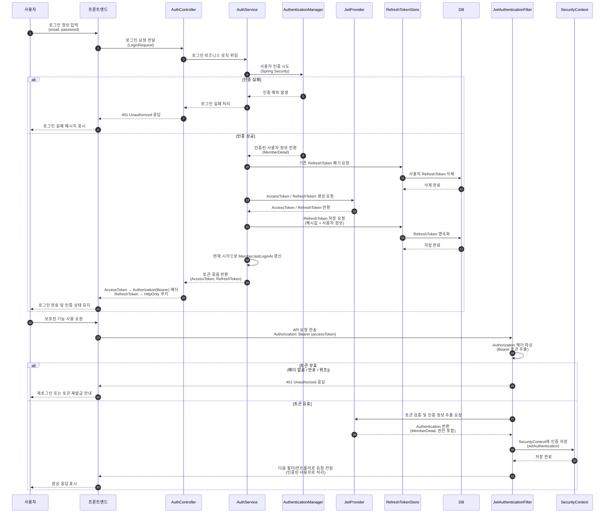
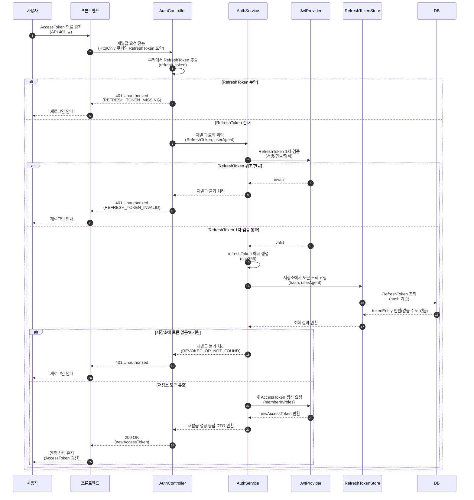
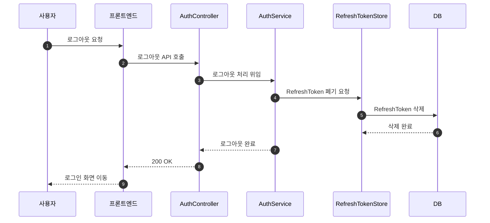
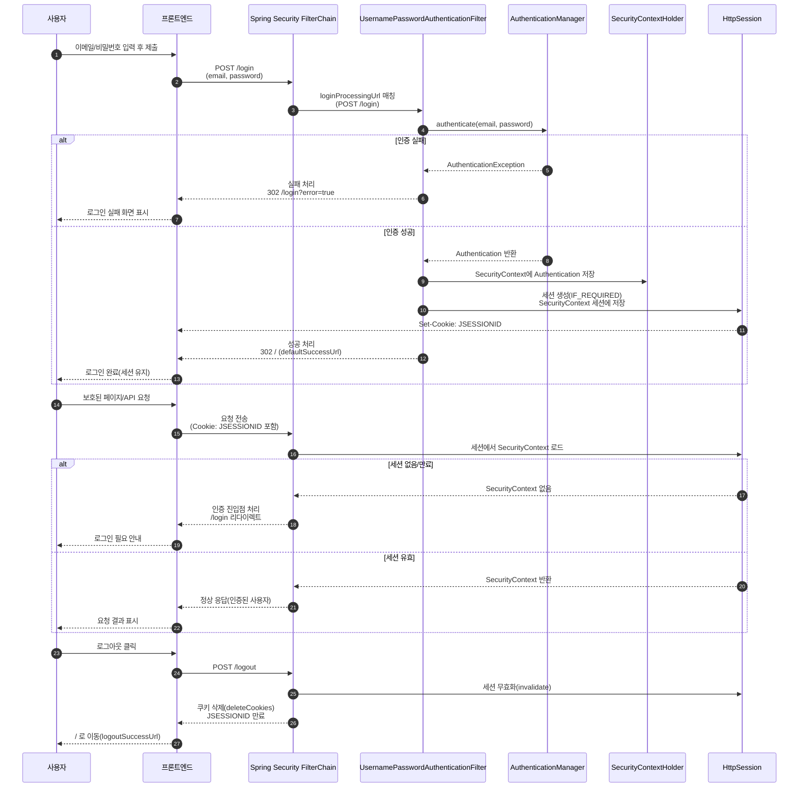

# JWT 인증 방식 로그인 로직

## 기능 개요
- JWT 인증 방식은 토큰 기반 인증을 통해 서버의 세션 상태에 의존하지 않고
API 요청을 인증하는 구조이다.
- AccessToken과 RefreshToken을 분리하여
보안성과 확장성을 함께 고려한 인증 흐름을 구성하였다.
  - AccessToken은 짧은 수명으로 API 인증에 사용
  - RefreshToken은 서버 저장소(DB)에 관리하여 재발급 및 로그아웃을 제어

### [로그인]

### [AccessToken 재발급]

### [로그아웃]

---

# 세션 기반 로그인 로직

## 기능개요
- 세션 기반 로그인은 Spring Security의 기본 인증 모델로, 서버가 로그인 상태를 세션에 저장하고 관리하는 방식이다.
- View(SSR, Thymeleaf) 기반 웹 애플리케이션의 페이지 이동, redirect, form submit 흐름과 자연스럽게 결합된다.
  - 로그인 상태는 서버 세션(HttpSession)에 저장
  - 클라이언트는 인증 정보를 직접 관리하지 않음
  

-----
# JWT 방식 도입 후 세션 방식으로 전환한 이유
본 프로젝트는 Thymeleaf 기반의 서버 사이드 렌더링(View, SSR) 구조로 진행되었으며,  
초기 설계 단계에서는 확장성과 학습 목적을 고려하여 JWT 기반 인증 방식을 도입하였다.

JWT를 적용하여 AccessToken / RefreshToken 발급, 인증 필터 구성 등 기본적인 인증 구조를 구현하였으나,  
개발을 진행하는 과정에서 프로젝트의 실제 요청 흐름과 개발 일정 측면에서 부담이 커진다는 점을 인지하게 되었다.

이에 따라 개발 중반부에 인증 방식에 대한 재검토를 진행하였고, 최종적으로 세션 기반 인증 방식으로 전환하는 의사결정을 내렸다.

## 1. JWT 적용 과정에서 예상보다 많은 추가 작업이 발생
JWT 방식으로 View 기반 기능을 구현하는 과정에서 다음과 같은 추가적인 고려 사항이 필요했다.
- redirect 및 form submit 요청 시 토큰 전달 문제
- AccessToken 만료 시 재발급 흐름 설계
이러한 요소들은 기술적으로 해결 가능했으나, 인증 로직에 예상보다 많은 구현 및 디버깅 시간이 소요되었고, 전체 기능 개발 일정에 영향을 줄 가능성이 있다고 판단하였다.

## 2. 개발 완료 기한을 고려한 인증 방식 전환 결정
본 프로젝트에서 중요하게 고려한 핵심 기능은 다음과 같다.
- 주문/결제 기능
- 마이페이지 기능
- 상품 관리 기능
- 리뷰/ 문의 / 위시리스트
이러한 핵심 기능들을 정해진 기간 내에 안정적으로 완성하는 것이 프로젝트의 가장 중요한 목표였다.

이 기준으로 재검토한 결과, Spring Security의 기본 흐름을 그대로 활용하여 로그인 개발 시간을 단축하는
세션 기반 인증 방식이 더 적합하다고 판단하였다.

## 3. JWT → 세션 전환을 통해 얻은 효과
세션 기반 인증 방식으로 전환한 이후, 인증과 관련된 불필요한 설계 고민과 추가 구현을 줄일 수 있었다.
- Access Token을 쿠키에 담을지, Authorization 헤더에 담을지, 혹은 View 단에서 JavaScript로 주입할지에 대한 고민과 구현이 불필요해졌다.
- View(Thymeleaf) 환경에서 Access Token 만료를 어떻게 감지할 것인지, 만료 시 재발급 요청을 프론트엔드에서 처리해야 하는지, 
  혹은 백엔드 필터에서 감지하여 처리해야 하는지와 같은 토큰 재발급 흐름에 대한 설계 고민이 사라졌다.
그 결과 인증 로직에 소요되는 개발 시간을 줄이고, 비즈니스 로직과 핵심 기능 구현에 더 집중할 수 있었다.

### 결론
본 프로젝트는 Thymeleaf 기반의 View 중심 구조로 진행되었으며, JWT 방식은 redirect 및 토큰 관리 측면에서 추가적인 구현 부담이 발생하였다.
이에 따라 제한된 개발 기간 내에 핵심 기능을 안정적으로 완성하기 위해 Spring Security의 기본 흐름을 활용할 수 있는 세션 기반 인증 방식이 
프로젝트에 더 적합하다고 판단하여 전환하였다.