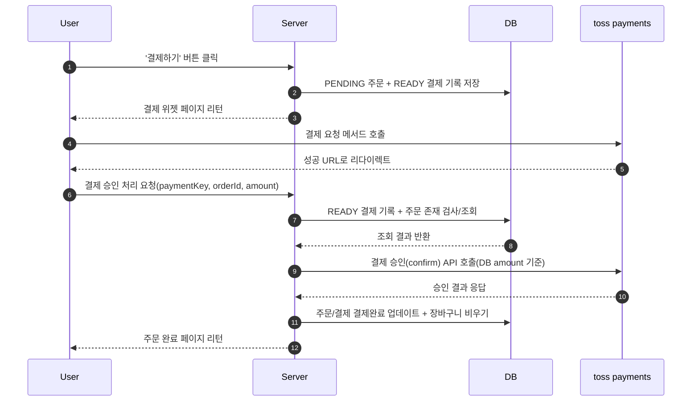
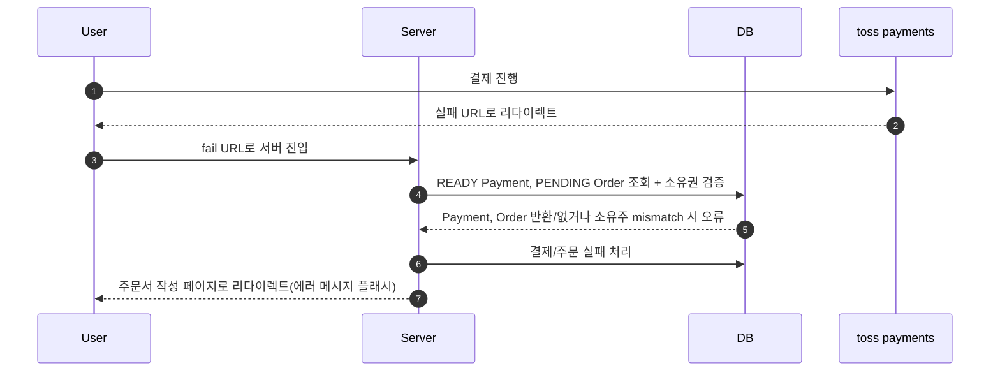

## 결제 (Toss Payments) 성공 처리 로직

### 기능 개요

- 사용자가 주문서 작성 후 결제 페이지에서 **Toss Payments 결제 위젯**을 통해 결제를 진행하는 기능입니다.
- 결제 페이지 진입 시, 서버에서는 **주문 상태(PENDING)** 를 검증한 후 **READY 상태의 결제(Payment)** 를 생성하거나 재사용합니다.
- 결제 성공 시 Toss로부터 전달받은 결제 정보에 대해
    - **금액 위·변조 검증**
    - **주문 소유권 검증**
    - **토스 결제 승인(confirm) API 호출**
      을 순차적으로 수행합니다.
- 결제 승인 완료 후, 주문/결제 상태를 변경하고 **후속 처리를 이벤트 기반으로 분리**하여 처리합니다.

---

### 결제 성공 시퀀스 다이어그램

---

### 핵심 로직 설명

#### 결제 페이지 진입

- `/orders/{orderId}/payment` 요청 시 주문 상태가 **PENDING** 인지 검증합니다.
- 기존에 **READY 상태의 결제**가 존재하면 재사용하고, 없을 경우 새 결제(`Payment`)를 생성합니다.
- 이를 통해 **새로고침 / 중복 진입** 상황에서도  
  **중복 결제 레코드 생성을 방지**합니다.

---

#### 결제 성공 콜백 처리

- Toss에서 전달된 결제 정보를 받은 사용자 브라우저가 전달하는  
  `paymentKey`, `orderId`, `amount`는 신뢰하지 않고  
  **반드시 서버의 결제 정보와 대조**합니다.

- 검증 순서:
    - **READY 결제 존재 여부**
    - **결제 금액 일치 여부 (`validAmount`)**
    - **주문 소유권 검증**
    - **Toss 결제 승인 API(confirm) 호출**

- confirm API는 **DB에 저장된 금액과 주문번호를 기준**으로 호출하여  
  **클라이언트 위·변조를 방어**합니다.

---

#### 결제 승인 이후 처리

- Toss 승인 성공 시에만:
    - `Payment → COMPLETED`
    - `Order → PAID`

- 이후 후속 작업(장바구니 비우기 등)은  
  `TossPaymentSucceedEvent` 이벤트로 분리합니다.

- 결제 승인 로직과 후처리 로직의 **결합도를 낮추고**  
  **트랜잭션 흐름을 명확히** 합니다.

---

### 기술적 의사결정

#### READY 결제 재사용 전략

- 결제 페이지 재진입 시 항상 새 Payment를 생성하지 않고  
  요청한 주문에 해당하는 READY 결제가 있다면 재사용하고  
  없으면 생성하도록 설계하여
- 중복 결제 데이터 및 결제 충돌을 방지합니다.

#### 금액 위·변조 방어

- 클라이언트로부터 넘어온 금액 정보는 **검증 용도로만 사용**합니다.
- confirm API 호출은 **DB에 저장된 결제 금액을 기준**으로 수행됩니다.

#### 이벤트 기반 후속 처리

- 결제 성공 이후 작업(장바구니 비우기)을 이벤트 리스너로 분리하여
- 결제 승인 메서드(결제 도메인)의 책임을 최소화합니다.

---

## 결제 (Toss Payments) 실패 처리 로직

### 기능 개요

Toss에서 실패 URL로 리다이렉트하거나 success 처리 중 예외가 발생하면, 서버는 결제 실패 처리 로직을 수행합니다.

실패 처리는 READY 상태의 결제 기록을 FAILED 처리, PENDING 상태의 주문도 FAILED 처리한 뒤
주문서 작성 페이지로 리다이렉트합니다.(플래시 메시지 포함)

---

### 결제 실패 시퀀스 다이어그램

---

### 핵심 로직 설명

- 마찬가지로 브라우저에서 넘어온 주문번호 정보를 믿지 않고  
  서버 DB와 대조하여  
  실제 사용자가 결제에 실패한 주문과 결제를 찾습니다.

---

### 추후 발전 방향

- 현재 코드는 사용자가 개발자가 기대하는 액션만 취한다는 가정 하에  
  정상 동작하도록 설계되어 있기 때문에  
  Happy Path만 기대하지 않고 그 외의 상황들에 대응할 수 있도록  
  설계 보강 필요.

- 현재 사용자가 주문서 작성 후 결제창으로 이동한 뒤  
  '주문서로 돌아가기' 버튼을 누르는 것이 아니라  
  '뒤로가기' 액션을 하면  
  생성된 주문 및 결제의 상태가 FAILED로 바뀌지 않고  
  그대로 PENDING, READY 상태로 DB에 남아있게 됨.

- 현재 사용자가 주문서 작성 후 결제창으로 이동한 뒤  
  브라우저 창을 닫으면  
  마찬가지로 주문과 결제 상태가 FAILED로 바뀌지 않은 채  
  DB에 남아있음.

- JS의 뒤로가기 감지 기능과 창 닫기 감지 기능을 사용하여  
  FAILED 전환 처리가 가능하도록  
  설계 보강 필요

---