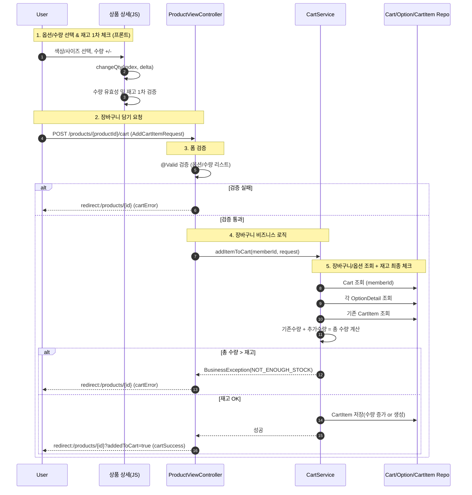

## 상품 상세 -> 장바구니 담기 로직
### 기능 개요

- 사용자가 상품 상세 페이지에서 색상/사이즈 옵션과 수량을 선택하여 장바구니에 담는 기능입니다.
- 여러 옵션을 한 번의 요청으로 장바구니에 추가할 수 있도록 설계했습니다.
- 동일한 옵션이 이미 장바구니에 존재할 경우, 새로운 항목을 생성하지 않고 수량을 증가시킵니다.
- 재고 검증은
  1. 상품 상세 페이지의 JavaScript에서 한 번,
  2. 장바구니 저장 시 백엔드(Service 계층)에서 한 번 더 수행합니다.

---
### 장바구니 담기 시퀀스 다이어그램

---
### 핵심 로직 설명

- **프론트(상품 상세 JS)**
  - 선택된 옵션과 수량은 `selectedItems`로 관리되며, 각 항목에는 현재 재고 정보가 함께 포함됩니다.
  - 수량 변경 시 프론트에서 1차 재고 검증을 수행하여, 재고를 초과하는 입력은 즉시 차단합니다.
  - 최종 선택된 옵션과 수량은 `optionDetailIds[]`, `quantities[]` 형태의 hidden 필드로 구성되어 장바구니 요청으로 전송됩니다.

- **Controller**
  - POST /products/{productId}/cart 요청을 받아 AddCartItemRequest로 바인딩합니다.
  - @Valid를 통해 옵션 및 수량에 대한 기본적인 입력값을 검증하고, 실패 시 에러 메시지를 전달한 뒤 상품 상세 페이지로 리다이렉트합니다.
  - 검증이 통과하면 장바구니 추가 로직을 Service 계층에 위임하며,
    발생한 비즈니스 예외는 메시지로 변환하여 상품 상세 페이지로 전달합니다.
  - 정상 처리 시 장바구니 추가 성공 메시지와 함께 상품 상세 페이지로 리다이렉트합니다.

- **Service**
  - 회원의 장바구니를 조회한 뒤, 요청으로 전달된 옵션과 수량을 순회하며 처리합니다.
  - 각 옵션에 대해 존재 여부를 검증하고, 기존 장바구니 항목이 있는 경우 수량을 합산하여 최종 수량을 계산합니다.
  - 최종 수량이 재고를 초과할 경우 예외를 발생시키며, 검증을 통과한 경우에만 장바구니 항목을 생성하거나 수량을 증가시킵니다.
  - 모든 처리는 트랜잭션 범위 내에서 수행되어, 중간 실패 시 장바구니 상태는 변경되지 않습니다.
  
---
### 기술적 의사결정
- 프론트/백엔드 이중 재고 검증
  - 사용자가 수량을 조정할 때 즉시 피드백을 주기 위해, 프론트 JS에서 먼저 재고를 검증합니다.
  - 클라이언트 조작/우회, 동시성 문제 등을 방어하기 위해, 장바구니 저장 시 백엔드에서 재고를 한 번 더 검증합니다.
  - 이 구조를 통해 UX와 데이터 정합성을 동시에 확보하고자 했습니다.
- 다중 옵션 일괄 처리
  - 여러 옵션을 한 번의 요청으로 장바구니에 담을 수 있도록 optionDetailIds와 quantities를 리스트로 받는 DTO(AddCartItemRequest) 구조를 사용했습니다.
  - 이를 통해 옵션별 개별 요청을 줄이고, 장바구니 담기 로직을 단순하게 유지합니다.
- CartItem 병합
  - (cartId + optionDetailId)를 기준으로 장바구니 항목을 조회/관리하여 동일 옵션이 중복된 행으로 쌓이지 않도록 했습니다.
  - 같은 옵션은 하나의 CartItem에서 수량만 증가하는 형태로 관리해, 장바구니 및 주문서 화면 로직을 단순화했습니다.

---
### 추후 발전 방향
- 비로그인 사용자를 위한 임시 장바구니 도입
  - 현재는 로그인된 회원의 Cart만을 대상으로 처리하고 있습니다.
  - 향후 세션 또는 쿠키 기반의 임시 장바구니를 도입하여, 비로그인 사용자도 장바구니 기능을 사용할 수 있도록 확장할 수 있습니다.
- 옵션 검증 책임 분리 및 도메인 규칙 캡슐화
  - 현재 CartService에서 OptionDetailRepository를 통해 옵션을 조회한 뒤, 재고 검증 로직까지 함께 처리하고 있어
    장바구니 도메인에 옵션 도메인 규칙이 일부 섞여 있는 상태입니다.
  - 재고 검증과 같은 옵션 관련 도메인 규칙을 CartService에서 OptionDetail 엔티티로 이동시켜,
    각 도메인이 자신의 상태와 규칙을 책임지도록 개선할 수 있습니다.
  - 이 구조에서는 Service 계층이 트랜잭션 관리와 흐름 제어에 집중하고,
    엔티티는 자신의 상태에 대한 검증 로직을 제공하는 역할을 수행합니다.
    CartService는 OptionDetail 엔티티의 도메인 메서드(예: `validateCartQuantity(totalQuantity)`)만 호출하도록 단순화할 수 있습니다.
  - 이를 통해 옵션 관련 규칙은 옵션 도메인 내부에 모으고,
    CartService는 장바구니 항목 생성과 수량 조정에 집중할 수 있어 전체 도메인 응집도를 높일 수 있습니다.