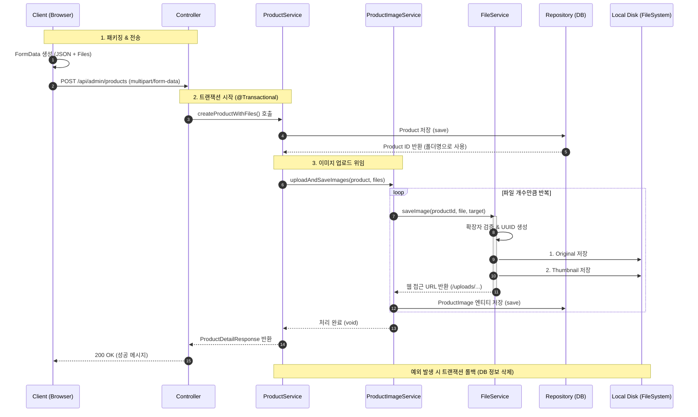

## 상품 이미지 등록 및 관리 로직 

### 기능 개요
- 관리자가 쇼핑몰에 상품을 등록할 때, 상품의 기본 정보와 다수의 이미지 파일을 하나의 트랜잭션으로 처리하는 프로세스입니다. 
 
- 등록 시 이미지는 중복방지를 위해 UUID 기반의 파일명을 가지고,  productId와 이미지 타입에 따른 폴더링 및 경로가 정해집니다.

[상품 등록 시퀀스 다이어그램]

### 핵심 로직 설명

- ProductService
  - 이미지를 저장할 폴더명으로 productId를 사용하기 위해, 이미지를 처리하기 전 상품 엔티티를 먼저 save() 합니다.
- ProductImageService
  - DB 트랜잭션은 자동 롤백되지만, 파일 시스템(Disk)은 롤백되지 않습니다. 따라서 try-catch 블록에서 예외 발생 시, 요청 동안 생성된 물리적 파일들을 추적하여 삭제하는 로직으로 고아파일이 생기는 걸 방지하고자 했습니다.
- FileService
  - 파일 입출력 및 및 이미지 가공을 담당합니다. FileConfig와 ImageConfig에서 정의한 경로와 이미지 사이즈를 바탕으로 이미지들을 저장하고 url을 반환합니다.
  

### 기술적 의사결정
- 상품 ID 기반의 디렉토라 폴더링 전략
  - 이미지 저장 경로를 /uploads/products/{productId}/ 형태로 상품 ID에 종속되도록 설계했습니다.
  - 상품(Product)과 상품 이미지(ProductImage)는 생명주기를 같이하는 관계입니다. 상품이 삭제될 때 해당 폴더만 삭제하면 관련 이미지(원본, 썸네일 등)가 디스크에서도 깔끔하게 정리되도록 하고자 했습니다.
  - 한계
    - 이미지를 저장하기 위해 반드시 상품 ID가 먼저 생성되어야 하므로, 상품 저장 후 이미지 처리를 강제하게 되었습니다. 이로 인해 이미지 업로드 실패 시 DB 롤백이 추가적으로 요구됩니다.

- 썸네일 이미지 url 역정규화 전략
  - ProductImage 테이블이 존재함에도, 대표 이미지의 썸네일 URL을 Product 테이블의 thumbnailUrl 필드에도 중복 저장했습니다.
  - 단일 테이블 조회만으로 상품 목록을 랜더링 하여 조회 성능을 높이고자 했습니다.

### 추후 발전 방향
- 서버 구조 변화에 따른 경로 설정
  - 현황: 현재는 로컬 디스크(C:/uploads)에 파일을 직접 저장하고 있습니다.
  - 한계: 서버를 여러 대로 증설할 경우, A 서버에 저장된 이미지를 B 서버에서 조회할 수 없는 동기화 문제가 발생합니다. 
  - 개선 계획: 클라우드 등의 외부 스토리지 사용 혹은 모든 서버가 경로를 공유하는 스토리지를 구성하고자 합니다.

