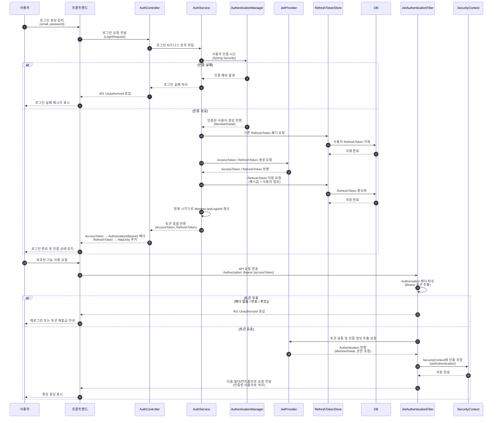
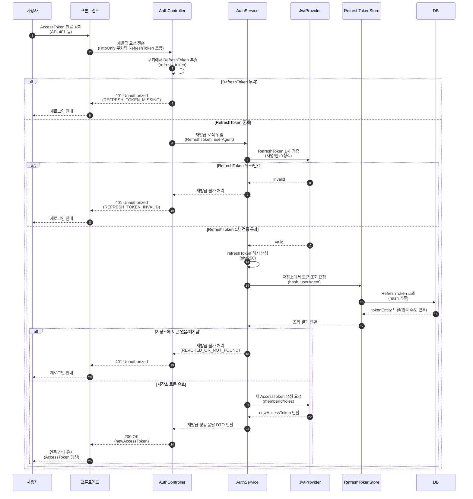
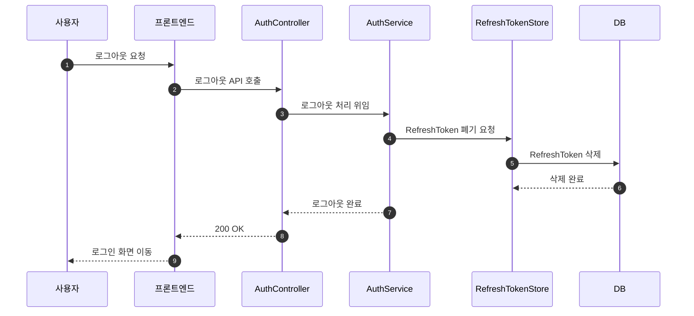
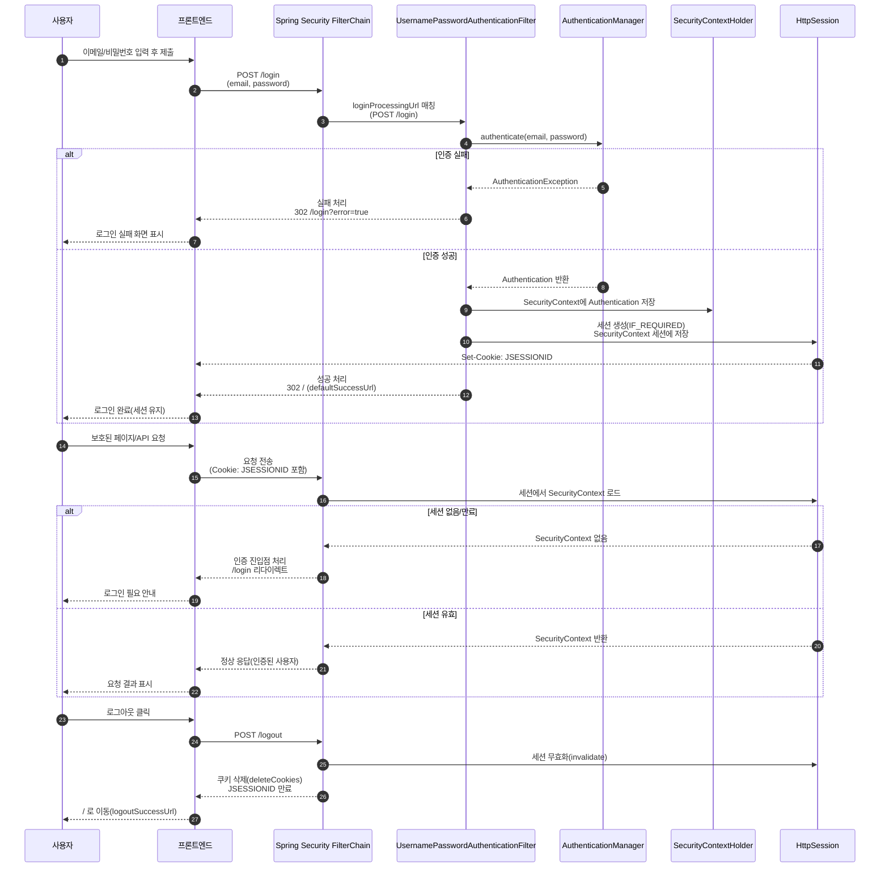

# JWT 인증 방식 로그인 로직

## 기능 개요
- JWT 인증 방식은 토큰 기반 인증을 통해 서버의 세션 상태에 의존하지 않고
API 요청을 인증하는 구조이다.
- AccessToken과 RefreshToken을 분리하여
보안성과 확장성을 함께 고려한 인증 흐름을 구성하였다.
  - AccessToken은 짧은 수명으로 API 인증에 사용
  - RefreshToken은 서버 저장소(DB)에 관리하여 재발급 및 로그아웃을 제어

### [로그인]

### [accessToken 재발급]

### [로그아웃]

---

# 세션 기반 로그인 로직

## 기능개요
- 세션 기반 로그인은 Spring Security의 기본 인증 모델로, 서버가 로그인 상태를 세션에 저장하고 관리하는 방식이다.
- View(SSR, Thymeleaf) 기반 웹 애플리케이션의 페이지 이동, redirect, form submit 흐름과 자연스럽게 결합된다.
  - 로그인 상태는 서버 세션(HttpSession)에 저장
  - 클라이언트는 인증 정보를 직접 관리하지 않음
  

---
# JWT 방식이 View(View, SSR, Thymeleaf) 방식과 맞지 않았던 이유

- 본 프로젝트는 Thymeleaf 기반의 서버 사이드 렌더링(View 방식) 을 사용하며, 
  로그인 이후에도 페이지 이동, redirect, form submit 이 빈번하게 발생하는 구조이다.
- 이러한 환경에서 JWT 인증을 적용한 결과, 
  JWT의 설계 철학과 View 방식의 요청 흐름 사이에 구조적인 부조화가 발생하였다.

## 1. View 방식에서는 Authorization 헤더 유지가 자연스럽지 않다
JWT 인증은 기본적으로 다음 전제를 가진다.
- 매 요청마다 Authorization: Bearer {AccessToken} 헤더 포함
- 클라이언트가 토큰 전달을 명시적으로 관리

그러나 View 기반 웹 환경에서는 브라우저가 페이지 이동, redirect, form submit 과정에서  
Authorization 헤더를 자동으로 유지하거나 주입하지 않는다.

그 결과, 모든 요청에 토큰을 포함시키기 위해  
JavaScript(fetch, axios 등)를 강제적으로 개입시켜야 하며,  
이는 View 기반의 단순한 요청 흐름을 깨뜨리는 원인이 된다.

## 2. View 방식에서는 로그인 상태를 프론트엔드가 알 필요가 없다.
View 기반 인증의 이상적인 구조는 서버가 로그인 상태를 관리하여 
클라이언트는 인증 여부를 신경 쓰지 않고 사용 가능한 환경이다.

하지만 JWT를 사용할 경우 AccessToken 저장 위치(LocalStorage / JS 변수 등)를 결정해야 하고, 
토큰 만료 여부를 클라이언트가 인지해야 하며 만료 시 재발급 요청을 프론트엔드가 제어해야 한다.

이는 View 환경에서 불필요한 토큰 관리 및 재발급 로직이 추가되어 프론트엔드 복잡도가 증가한다.

## 3. View 방식은 세션 기반 인증 모델과 더 자연스럽게 결합된다
View 기반 웹 애플리케이션의 로그인 흐름은
Spring Security의 세션 기반 인증 모델과 매우 잘 부합한다. 
세션 기반 인증 모델은 로그인 성공 시 SecurityContext를 세션에 저장하고 
이후 요청은 JSESSIONID 쿠키만으로 인증 상태를 유지할 수 있다. 

이 구조에서는 인증 및 인가 책임이 전적으로 서버에 집중되며, 프론트엔드는 인증 상태를 별도로 관리할 필요가 없어 
구조적으로 단순하고 안정적인 인증 흐름을 구성할 수 있다.

#### 결론
- JWT는 명시적인 API 요청에는 적합했지만,  redirect와 form submit이 중심인 View 기반 인증 흐름과는  구조적으로 맞지 않아 세션 기반 인증으로 전환하였다.
